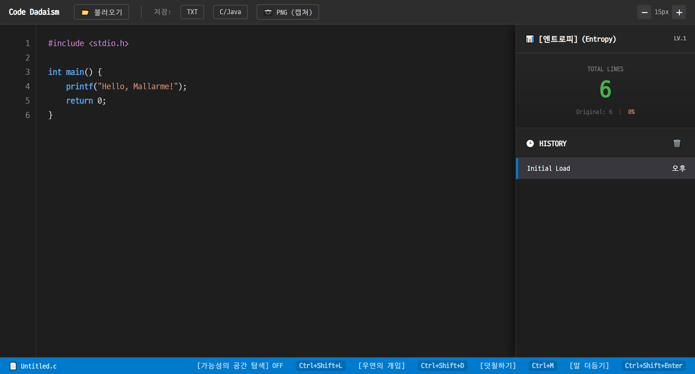
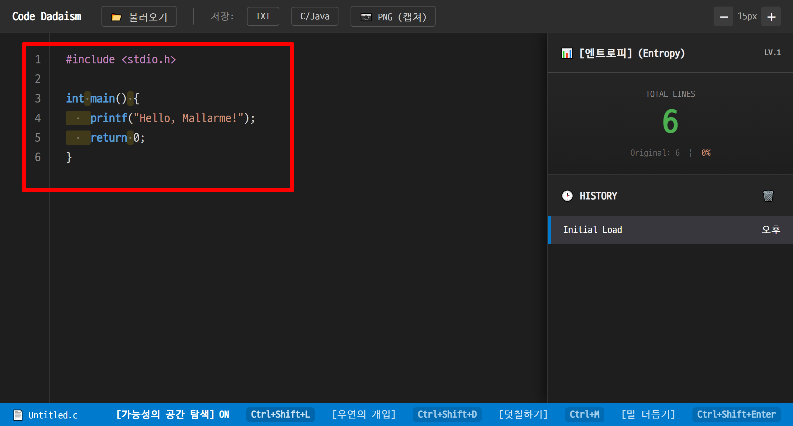
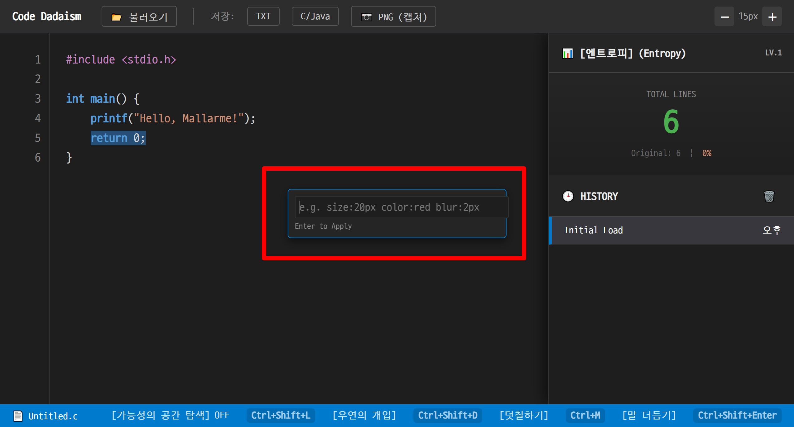
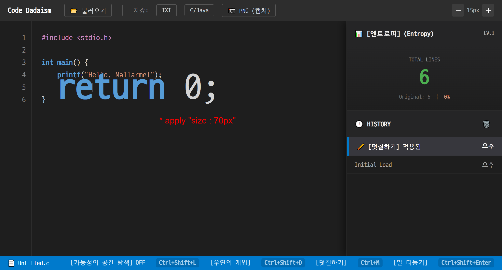
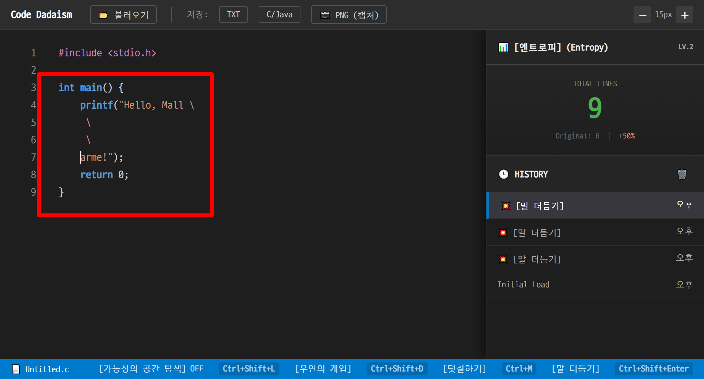
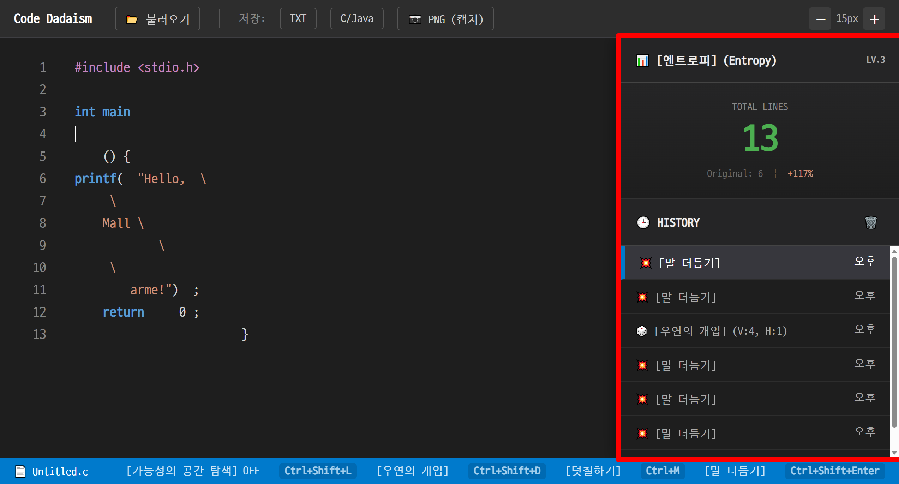
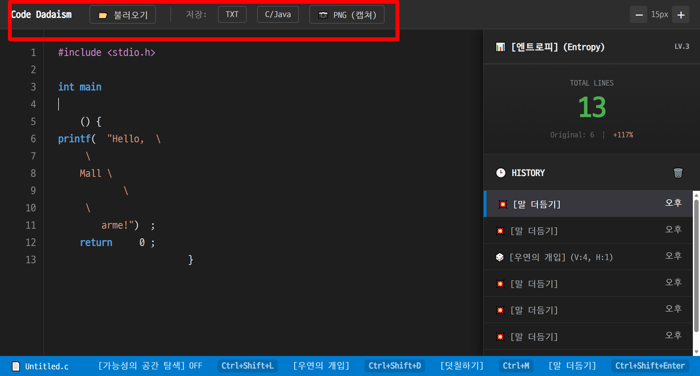
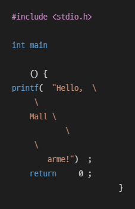

# CodePoetryEditor — A Throw of the Code



---

## 1. 프로젝트 소개

> *« Un coup de dés jamais n’abolira le hasard. »*  
> *“한 번의 주사위 던짐이 우연을 지워버리진 못하리.”*  
> — Stéphane Mallarmé (스테판 말라르메)


**CodePoetryEditor**는 코드의 “기능”만큼 주목받지 않 “형식”과 “리듬”을 탐구하기 위해 만들어진 실험적 에디터입니다.  
문법 요소는 그대로 유지한 채, 여백·줄바꿈·시각적 레이어를 변형하여  
코드를 하나의 시각적·시적인 텍스트로 감상할 수 있도록 설계되었습니다.

실행 시 가장 먼저 등장하는 코드는  
**“Hello, Mallarmé!” — 말라르메를 향한 작은 인사로 시작하는 C 프로그램**입니다.   
이 코드는 이후의 여백·간격·우연성 조작을 실험하는 출발점이 되며,  
Mallarmé의 조판적 시학을 코드에 적용해보는 첫 단계입니다.

---

- **형태**: 순수 HTML/CSS/JavaScript로 구현된 단일 페이지 웹 도구  
- **실행 환경**: 최신 브라우저(Chrome, Edge 등)만 있으면 동작하며 별도 설치가 필요 없습니다.  
- **역할**:
  - 코드의 “의미”는 보존한 채,  
    **공백·간격·덧칠 레이어** 등을 통해 코드의 외형과 리듬을 과장하는 실험 도구
  - Mallarmé의 *Un coup de dés*가 시의 공간을 해체하듯,  
    우연성·여백·조판(typography)을 코드 편집기 문맥에 적용해 보는 시도


---

## 2. 주요 기능

### 2-1. 코드 에디터 & 라인 넘버, 문법 하이라이트

- 좌측 **라인 넘버**, 우측 **코드 영역** 구조의 에디터
- 간단한 토큰화로 C/Java 스타일 문법을 색상으로 구분:
  - 키워드, 문자열, 주석, 전처리기 등
- 라인 넘버, 코드, 배경 레이어가 스크롤에 맞춰 동기화

---

### 2-2. 입력 제약 — “내용 봉인, 여백만 허용”

이 에디터의 핵심 컨셉은:

> “코드의 **내용**은 보존하고, **여백**과 **배치**만 자유롭게 재구성하자.”

그래서 입력 제약이 걸려 있습니다.

- **새 문자 직접 타이핑 불가**
  - `beforeinput`에서 공백이 아닌 문자의 삽입을 차단
- **한글 입력 차단**
  - 한글이 들어오면 이전 상태로 롤백 + 경고 메시지
- **붙여넣기 / 잘라내기 / 대부분의 삭제 차단**
  - `Ctrl+V`, `Ctrl+X`, 마우스 붙여넣기 등 금지
  - 토큰(키워드, 식별자 등)의 일부만 지워 구조를 깨뜨리는 행위 방지
- **예외적으로 허용되는 것**
  - 공백, 줄바꿈, 주석 내부, 줄 연결용 `\ + 개행` 등 일부 안전한 영역

→ 사용자는 **“문장” 대신 “여백과 줄 간격”을 편집하는 과정**을 통해 코드 작성의 수행성에 대해 고찰하게 됩니다.

---

### 2-3. [가능성의 공간 탐색] 모드 (Guide Mode)



- 상단 상태바 버튼 또는 단축키로 토글:
  - `Ctrl + Shift + L`
- 공백(스페이스, 탭, 줄바꿈)을 별도 토큰으로 표시하여  
  **코드 사이의 간격과 패턴을 시각적으로 강조**
- 상태바에 `[가능성의 공간 탐색] ON/OFF` 표시

---

### 2-4. [우연의 개입] 모드 (Dadaism)


- 헤더/상태바 버튼 또는 단축키:
  - `Ctrl + Shift + D`
- 모달에서 두 가지 슬라이더 제공:
  1. **수직 분해 (Vertical)**:  
     - 줄 사이에 임의 줄바꿈을 추가해 코드를 위아래로 늘어뜨림
  2. **수평 분해 (Horizontal)**:  
     - 토큰 사이의 공백을 늘리거나 쪼개어 **수평 방향 파편화** 생성
- 알고리즘은:
  - 키워드, 식별자, 문자열, 주석 등 “의미 단위”는 그대로 두고  
    **그 사이 공백만 랜덤하게 조정**하는 방식
- 실행 시:
  - 상태 메시지와 함께 HISTORY에 기록  
    예) `🎲 [우연의 개입] (V:3, H:5)`
  - 오른쪽 패널의 라인 수/Entropy 정보 갱신


---

### 2-5. [덧칠하기] 기능 (Overpainting)




- 단축키: `Ctrl + M`
  - 선택 영역이 없으면 **커서가 위치한 단어**를 자동 선택
- 커서 근처에 작은 팝업이 뜨고,  
  간단한 “미니 CSS 문법”으로 스타일을 지정할 수 있음:

예시 입력:

- `color:#ffcc00`
- `bg:#222222`
- `size:20px`
- `blur:2px`
- `bold:true`
- 또는 일반 CSS: `letter-spacing:4px`

- 내부적으로 선택 범위를 기록한 뒤,  
  렌더링 단계에서 특정 토막을 `<span>`으로 감싸  
  **강조 색·크기·블러 등의 “회화적인 레이어”를 입힘**

<!-- 스크린샷 추천: screenshot/overpainting.png (덧칠하기 팝업과 적용된 코드 화면) -->

---

### 2-6. [말 더듬기] 기능 (String Break)



- 단축키: `Ctrl + Shift + Enter`  
  (문자열 리터럴 안에서만 작동)
- 커서가 `"..."` 또는 `'...'` 문자열 내부에 있는지 확인 후 작동
- 언어별 동작:
  - **C 계열**: `\` + 개행 + 들여쓰기를 삽입해  
    한 줄 문자열을 여러 줄로 **더듬거리게** 나눔
  - **Java**: `"..." + "..."` 형태의 문자열 연결 문법을 사용해 줄을 끊음
- 실행 결과는 HISTORY에  
  `💥 [말 더듬기]` 같은 메시지로 남음

---

### 2-7. Entropy & History 패널



우측 패널은 **“얼마나 많이 해체되었는가”**를 보여주는 창입니다.

**Entropy 섹션**

- 원본 줄 수 vs 현재 줄 수 표시
- 증가한 비율에 따라 **성장률(%)** 표기
- 성장률에 비례해 단순한 **Chaos Level**을 부여

**History 섹션**

- 각 편집 액션(파일 열기, 우연의 개입, 덧칠하기, 말 더듬기 등)에 대해
  - 시점별 스냅샷과 메시지 기록
- 항목을 클릭하여 해당 시점의 코드 상태로 **롤백**
- `Ctrl + Z / Ctrl + Y`로 Undo/Redo도 지원

---

### 2-8. 파일 입출력 & PNG 캡쳐



- **코드 불러오기 (`Ctrl + O`)**
  - `.c`, `.cpp`, `.h`, `.hpp`, `.java` 파일을 지원
  - 불러온 즉시:
    - 에디터 내용 업데이트
    - 원본 라인 수 재설정
    - HISTORY에 `File Open: 파일명` 기록
- **코드 저장 (`Ctrl + S` 또는 버튼)**
  - 선택된 언어에 따라 `.c` 또는 `.java` 확장자로 다운로드
  - 단순 텍스트(.txt) 저장 버튼도 제공
- **PNG 캡쳐**
  - 현재 코드 화면을 다시 토큰화하여
    문법 색상을 유지한 채 `<canvas>`에 그린 뒤,
    하나의 PNG 이미지로 저장
  - 결과적으로 **“한 장짜리 코드 시”**를 이미지로 뽑아낼 수 있음
  - code_poetry_artifact.png로 저장됨



- **폰트 크기(Zoom)**
  - `＋`, `－` 버튼으로 에디터 기본 폰트 크기 조절

---

### 2-9. 상태바 & 단축키 요약

하단 상태바에는 현재 파일명과 함께  
주요 기능의 단축키가 안내된다.

- `Ctrl + O` : 코드 불러오기  
- `Ctrl + S` : 코드 저장  
- `Ctrl + Shift + L` : [가능성의 공간 탐색] 토글  
- `Ctrl + Shift + D` : [우연의 개입] 모드  
- `Ctrl + M` : [덧칠하기]  
- `Ctrl + Shift + Enter` : [말 더듬기] (문자열 내부)  
- `Ctrl + Z / Ctrl + Y` : Undo / Redo  

---

## 3. 실행 방법

1. 다운을 받고 로컬 폴더에서 `CodePoetryEditor.html` 파일을 더블 클릭합니다.
3. 최신 브라우저(Chrome, Edge, Firefox 등)에서 열립니다.
4. 상단 버튼과 상태바 단축키를 이용해  
   - 코드 불러오기  
   - [가능성의 공간 탐색], [우연의 개입], [덧칠하기], [말 더듬기]  
   기능들을 순서대로 시험해 볼 수 있습니다.

---

## 4. 개발 환경 및 파일 구성 (간단 요약)

- **사용 기술**
  - HTML5
  - CSS3
  - Vanilla JavaScript (외부 라이브러리 없음)

- **주요 파일**
  - `CodePoetryEditor.html` : 에디터 UI/스타일/스크립트가 모두 포함된 단일 파일  
  - `screenshot/overview.png` : 전체 화면 캡쳐 (README 상단)  
  - 그 외 `screenshot/*.png` : 기능별 스크린샷

---

## 5. 라이선스 및 참고

- 이 프로젝트는 **MIT License** 하에 배포됩니다.  
  자세한 내용은 저장소의 `LICENSE` 파일을 참고하세요.

  ### 폰트 사용 및 출처

-  이 프로젝트의 코드 렌더링에는 **NAVER D2Coding 폰트**가 사용되었습니다.  
  브라우저 환경에 의존하지 않고 동일한 타이포그래피를 유지하기 위해  
  HTML 내부에 **Base64 인라인 폰트 데이터**로 포함하였습니다.

- 폰트 출처: https://github.com/naver/d2codingfont  
- 사용한 버전: D2Coding (Basic, Bold 미포함)

```css
@font-face {
    font-family: 'CodePoetryFont';
    /* D2Coding Basic (bold 미포함) — base64 인라인 포함 */
    /* https://github.com/naver/d2codingfont */
    src: url(data:font/woff2;charset=utf-8;base64, ... ) format('woff2');
    font-weight: normal;
    font-style: normal;
}
```

- 참고 및 영감
  - Stéphane Mallarmé, *Un coup de dés jamais n’abolira le hasard*  
  - 현대 코드 에디터(특히 VS Code)의 레이아웃과 단축키 인터페이스  
